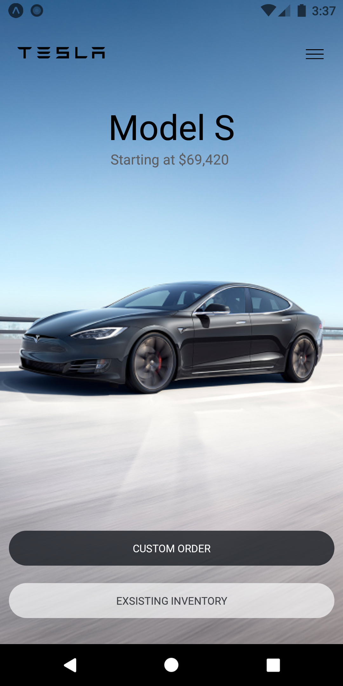
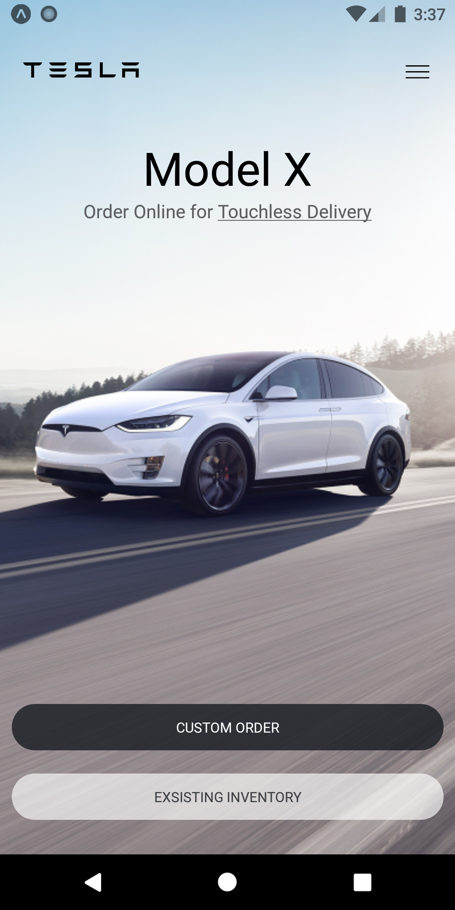

<!-- ABOUT THE PROJECT -->

## About The Project

<p align="center">
 
 
</p>

### Built With

- [React Native](https://reactnative.dev/)
- [Expo](https://expo.io/)

<!-- GETTING STARTED -->

## Getting Started

To get a local copy up and running follow these simple steps.

### Prerequisites

- node
- npm
- expo-cli

### Installation

1. Clone the repo

   ```sh
   git clone https://github.com/th3c0d3br34ker/tesla-clone.git
   ```

2. Install NPM packages

   ```sh
   npm install
   ```

3. Install Expo command line tool

   ```sh
   npm install --global expo-cli
   ```

4. Run the project
   ```sh
   npm run start
   ```

### Building the APK with expo

1.  Publish the app with expo

    ```sh
    expo publish
    ```

2.  Build the APK
    ```sh
    expo build:android
    ```
    for IOS run
    ```sh
    expo build:ios
    ```

<!-- LICENSE -->

## License

Distributed under the MIT License. See `LICENSE` for more information.

<!-- ACKNOWLEDGEMENTS -->

## Acknowledgements

- [Mosh Hamedani.](https://codewithmosh.com/)
- [Telsa](https://www.tesla.com/)

> Coded with 🖤 by Jainam Desai

<!-- MARKDOWN LINKS & IMAGES -->
<!-- https://www.markdownguide.org/basic-syntax/#reference-style-links -->

[contributors-shield]: https://img.shields.io/github/contributors/th3c0d3br34ker/tesla-clone.svg?style=for-the-badge
[contributors-url]: https://github.com/th3c0d3br34ker/tesla-clone/graphs/contributors
[forks-shield]: https://img.shields.io/github/forks/th3c0d3br34ker/tesla-clone.svg?style=for-the-badge
[forks-url]: https://github.com/th3c0d3br34ker/tesla-clone/network/members
[stars-shield]: https://img.shields.io/github/stars/th3c0d3br34ker/tesla-clone.svg?style=for-the-badge
[stars-url]: https://github.com/th3c0d3br34ker/tesla-clone/stargazers
[issues-shield]: https://img.shields.io/github/issues/th3c0d3br34ker/tesla-clone.svg?style=for-the-badge
[issues-url]: https://github.com/th3c0d3br34ker/tesla-clone/issues
[license-shield]: https://img.shields.io/github/license/th3c0d3br34ker/tesla-clone.svg?style=for-the-badge
[license-url]: https://github.com/th3c0d3br34ker/tesla-clone/blob/master/LICENSE.txt
[made-with-shield]: https://img.shields.io/github/languages/top/th3c0d3br34ker/tesla-clone?style=for-the-badge
[made-with-url]: https://shields.io/github/languages/top/th3c0d3br34ker/tesla-clone.svg?style-for-the-badge
[product-screenshot-1]: images/Screenshot_1.png
[product-screenshot-2]: images/Screenshot_2.png
